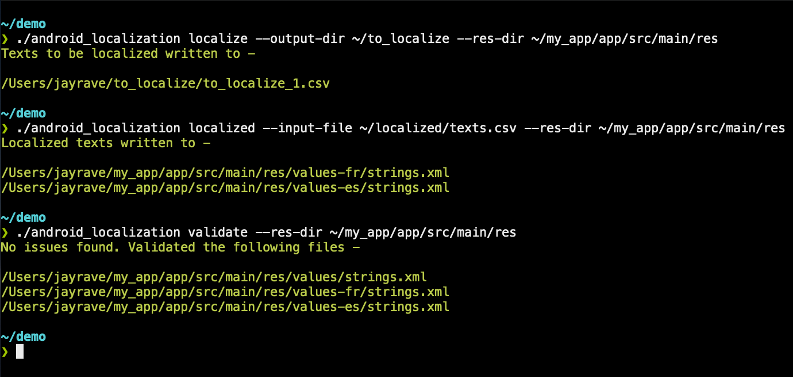

[](https://travis-ci.org/jayrave/android_localization) [](https://github.com/jayrave/android_localization/releases/latest)

android_localization is a command line program to ease working with `strings.xml` for localizing to non-default locales


# Commands
- **localize** - Creates CSVs of texts that need to be localized
- **localized** - Populates strings XML files from localized texts in CSVs
- **validate** - Runs some common validations on XML string files


# Quick tour
You are working on your Android app or library & now it is time to localize to non-defaults locales. Probably you wanna find the texts that are yet to be localized, ship them off to a localization service, put the texts in when it comes back & make sure that it didn't get messed up in any way. This CLI helps you automate everything except the actual localization.

```bash
./android_localization localize --output-dir ~/to_localize --res-dir ~/my_app/app/src/main/res
./android_localization localized --input-file ~/localized/texts.csv --res-dir ~/my_app/app/src/main/res
./android_localization validate --res-dir ~/my_app/app/src/main/res
```


## Sample input & output
### Localize
Let's say we start with these `strings.xml` files -
```xml
<!--values/strings.xml-->
<resources>
    <string name="string_1">string_1 default locale</string>
    <string name="string_2">string_2 default locale</string>
    <string name="string_3">string_3 default locale</string>
</resources>
```

```xml
<!--values-es/strings.xml-->
<resources>
    <string name="string_2">string_2 spanish</string>
</resources>
```

```xml
<!--values-fr/strings.xml-->
<resources>
    <string name="string_2">string_2 french</string>
</resources>
```

On running `./android_localization localize --output-dir <output_dir> --res-dir <res_dir>`, the created CSV would look thus -

| string_name | default_locale          | es | fr |
|-------------|-------------------------|----|----|
| string_1    | string_1 default locale |    |    |
| string_3    | string_3 default locale |    |    |


### Localized
Carrying on from the o/p of the `localize` command, once we put in the localized strings, the input CSV would look thus -

| string_name | default_locale          | es               | fr              |
|-------------|-------------------------|------------------|-----------------|
| string_1    | string_1 default locale | string_1 spanish | string_1 french |
| string_3    | string_3 default locale | string_3 spanish | string_3 french |

On running `./android_localization localized --input-file <input_file> --res-dir <res_dir>`, the `strings.xml`s would be populated & look thus -
```xml
<!--values-es/strings.xml-->
<?xml version="1.0" encoding="utf-8"?>
<resources>
    <string name="string_1">string_1 spanish</string>
    <string name="string_2">string_2 spanish</string>
    <string name="string_3">string_3 spanish</string>
</resources>
```

```xml
<!--values-fr/strings.xml-->
<?xml version="1.0" encoding="utf-8"?>
<resources>
    <string name="string_1">string_1 french</string>
    <string name="string_2">string_2 french</string>
    <string name="string_3">string_3 french</string>
</resources>
```


# Installation
Pre-built binaries can be found for the following platforms in the [release tab](https://github.com/jayrave/android_localization/releases/latest)
- Linux (64-bit)
- OSX (64-bit)
- Windows (64-bit)

Compiling from source under the assumption that the appropriate [rust toolchain is already installed](https://rustup.rs/):

```bash
git clone git@github.com:jayrave/android_localization.git
cd android_localization
cargo build --release
```


# Deployment
- Update version in `cli/Cargo.toml`
- Update `CHANGELOG.md`
- Add `release` tag which would trigger travis `deploy`
- Once all executables are uploaded, publish the draft release
